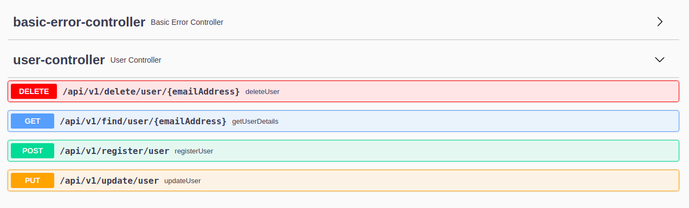
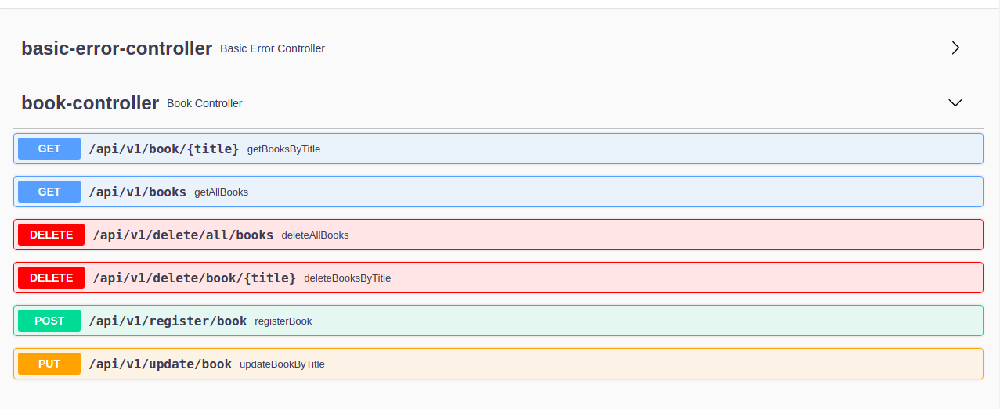

# Ekahau-Exercise
This application has 3 modules :- \
**common-config** :  This section has spring security configuration. One embeded MariaDB mysql server which has been used here in case of testing purpose.\
**user-service** : This section has user repository to connect to database and User Controller for Rest Web Services and CRUD operation.\
**book-service** : This section has book repository to connect to database and Book Controller for Rest Web Services and CRUD operation.

###PreRequite:
openJdk 11\
docker\
make - for unix system by default make will be installed.

### How To Start The Application

####For Ubuntu :-
* **make start_application**

####For Windows :- 
you need to follow some manual steps for now:\
go inside the project directory - **cd ekahau-exercise-microservice**
1. **gradle clean build**\
2. **docker build --no-cache -t mysql-test-db ./mysqldb**\
3. **docker build --no-cache -t user-service ./user-service**\
4. **docker build --no-cache -t book-service ./book-service**\
5. **docker-compose up -d**

####In case docker is not installed -
Load the project in any IDE as gradle project. Run MySqlServer.java file(Contains a main method). That will provide you necessary MySql env as a database.

### Api Documentation
[User Service API](http://localhost:8080/swagger-ui/)

[Book Service API](http://localhost:8081/swagger-ui/)

All the required endpoints are Authenticated except -
[**Register User**](http://localhost:8080/swagger-ui/#/user-controller/registerUserUsingPOST) : /api/v1/register/user

