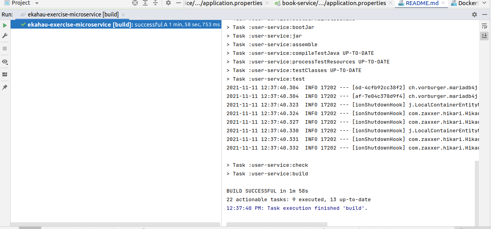

# Ekahau-Exercise
This application has 3 modules :- \
**common-config** :  This section has spring security configuration. One embeded MariaDB mysql server which has been used here in case of testing purpose.\
**user-service** : This section has user repository to connect to database and User Controller for Rest Web Services and CRUD operation.\
**book-service** : This section has book repository to connect to database and Book Controller for Rest Web Services and CRUD operation.

###PreRequite:
openJdk 11\
gradle 6.9.X or above\
docker\
make - for unix system by default make will be installed.

### How To Start The Application

* ####For Ubuntu :-
   * **make start_application**

* ####For Windows :- 
  * you need to follow some manual steps for now:\
go inside the project directory - **cd ekahau-exercise-microservice**
  1. **gradle clean build**
  2. **docker build --no-cache -t mysql-test-db ./mysqldb**
  3. **docker build --no-cache -t user-service ./user-service**
  4. **docker build --no-cache -t book-service ./book-service**
  5. **docker-compose up -d**

* ###In case docker is not installed -
    Load the project in any IDE as gradle project. Build the project.

    1. Go to project root directory - "ekahau-exercise-microservice"
    2. Start Mysql : Run MySqlServer.java file(Contains a main method).\
    You can run that from IDE or by using **java -jar build/libs/common-config-1.0.jar**\
    That will provide you necessary MySql env as a database.
    3. Start User Service :  Run ExerciseUserApplication from IDE or in another CMD window/Terminal run **java -jar user-service-1.0.jar**
    4. Start Book Service :  Run ExerciseBookApplication from IDE or in another CMD window/Terminal run **java -jar book-service-1.0.jar**

### Api Documentation
[User Service API](http://localhost:8080/swagger-ui/)

[Book Service API](http://localhost:8081/swagger-ui/)

All the required endpoints are Authenticated except -
[**Register User**](http://localhost:8080/swagger-ui/#/user-controller/registerUserUsingPOST) : /api/v1/register/user

### Troubleshooting
* Sometimes if you are using older IDE versions then your "Annotation Processor" may not be enabled and you may see error in compilation.
* Sometimes old gradle version is picked up from the IDE gradle settings.
* Sometimes in windows systems, there can be build failure due to UTF-8 encoding issue. Due to the special characters are present in the customer name. Please make sure your IDE is using UTF-8 encoding for .sql and .txt files.
* After import of the project make sure gradle build is success.
* Gradle Build Success Image : 
